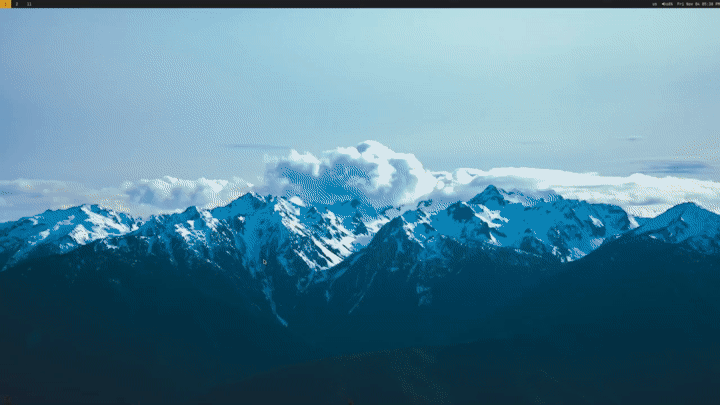

# Dotfiles for Arch with XFCE and i3wm

These are my dotfiles for Arch Linux using XFCE as the DE and i3 as the WM. These are my personal dotfiles that I keep synced between my laptop (x230) and my home machine.

Dotfiles are managed by [stow](https://www.gnu.org/software/stow/)

I've created a rudimentary install script but it's still not up-to-date (and probably never will be since I modify so frequently)

## Neovim and VS Code 

[VS Code with neovim extension](screenshot/vscode-nvim.png)

## zsh

I wanted to avoid a heavy zshrc and heavily utilized [chris@machine](https://www.youtube.com/watch?v=bTLYiNvRIVI) zsh dotfiles for a light and minimal setup.

## Programs 

- DE: [XFCE](https://www.xfce.org/)
- WM: [i3-gaps](https://github.com/Airblader/i3gaps/)
- Shell: [zsh](https://github.com/zsh-users/zsh)
- Terminal: [kitty](https://github.com/kovidgoyal/kitty)
- File Manager: [lf](https://github.com/gokcehan/lf)
- Bar: [polybar](https://github.com/polybar/polybar)
- Launcher: [rofi](https://github.com/davatorium/rofi)
- Text Editor: [neovim](https://github.com/neovim/neovim)
- Code Editor: [VS Code](https://code.visualstudio.com/)
- Compositor: [picom](https://github.com/yshui/picom)
